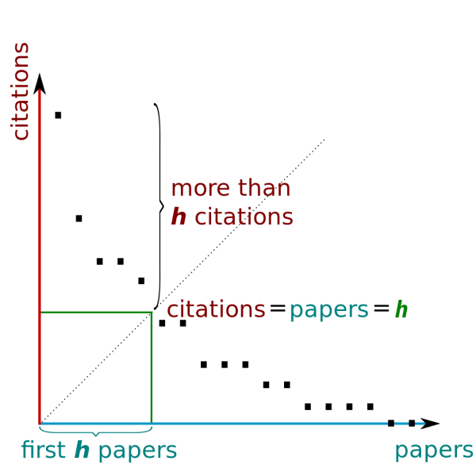

# H-Index
## What it is
The h-index is an author-level metric that combines information from the author’s publications and citations. The h-index is the maximum number of an author’s publications that are each cited at least h times. It was proposed in 2005 by Jorge Hirsch(1).
## How it works

An author with an h-index of 5 has five publications that have been cited at least five times each (see figure). The formula for calculating the h-index is openly available. See https://en.wikipedia.org/wiki/H-index.

You can can retrieve the h-index directly from [Google Scholar](http://scholar.google.com/), [Scopus](https://www.elsevier.com/solutions/scopus), or [Web of Science](https://webofknowledge.com/), or you can calculate it manually with citation data retrieved from Google Scholar, Scopus, Web of Science, Dimensions or any other citation index that includes author- and article-level citation information. To manually calculate the h-index, just rank the papers in decreasing citation count. The h-index is the lowest rank that is greater than or equal to the citation count.

Although the original definition of the h-index applied to the full set of papers of individual authors, several extensions or generalizations have been proposed. The h-index can thus be calculated for any subset of an author’s, or group of authors’ publications over any time period (such as an aggregation of publications, e.g. journals, institutions, etc.). Use of the h-index for groups occurs infrequently in practice. However, Google Scholar maintains a ranked list of journals by their [h5-index](https://scholar.google.com/citations?view_op=top_venues&hl=en).
## What to keep in mind
The h-index should not be used as a sole metric of scholarly impact, nor should it be used as a direct measure of quality. The h-index should not be used to rank authors in different disciplines or those at different stages of their careers. Many limitations to the h-index have been identified by bibliometrics experts(2).
- *Cannot compare researchers with varying career lengths.* The h-index varies by discipline due to varying norms of publishing speed and quantity. Since it does not take into account the longevity of a scholar’s career, it benefits more experienced scholars over early-career individuals.
-*Bias towards productive fields and insensitive to high citation counts.* The h-index is unable to differentiate between active and inactive scientists, and is biased towards productive researchers in detriment of selective ones(3). The h-index is also relatively insensitive to highly cited papers because it can never be higher than the total output published by a scholar regardless of the citation impact of that output .

Many have attempted to fix the h-index’s weaknesses with various computational models that, for example, [reward highly-cited papers](http://en.wikipedia.org/wiki/G-index), [correct for career length](http://blogs.plos.org/biologue/2012/10/19/why-i-love-the-h-index/), rank authors’ papers against other papers published in the same year and source(4), or count just the average citations of the most high-impact “core” of an author’s work(5). However, none of these improvements upon the h-index have been as widely adopted as the h-index itself.
## Learn more
Understanding the H-index. Becker Medical Library. 2017. Available at: [https://vimeo.com/173624979](https://vimeo.com/173624979)
## Related metrics
Portions of this guide borrow from [Four reasons to stop caring so much about the h-index](http://blogs.lse.ac.uk/impactofsocialsciences/2014/03/31/four-reasons-to-stop-caring-so-much-about-the-h-index/) by Stacy Konkiel and are reused here under a CC-BY license.
## References
Hirsch, J. E. (2005). An index to quantify an individual's scientific research output. Proceedings of the National academy of Sciences, 102(46), 16569-16572. [https://doi.org/10.1073/pnas.0507655102](https://doi.org/10.1073/pnas.0507655102)
Bornmann, L., & Daniel, H. D. (2007). What do we know about the h index?. Journal of the American Society for Information Science and technology, 58(9), 1381-1385. [https://doi.org/10.1002/asi.20609](https://doi.org/10.1002/asi.20609)
Costas, R., & Bordons, M. (2007). The h-index: Advantages, limitations and its relation with other bibliometric indicators at the micro level. Journal of informetrics, 1(3), 193-203. [https://doi.org/10.1016/j.joi.2007.02.001](https://doi.org/10.1016/j.joi.2007.02.001)
Pudovkin, A. I., & Garfield, E. (2009). Percentile rank and author superiority indexes for evaluating individual journal articles and the author’s overall citation performance. COLLNET Journal of Scientometrics and Information Management, 3(2), 3-10. [https://doi.org/10.1080/09737766.2009.10700871](https://doi.org/10.1080/09737766.2009.10700871)
Bornmann, L., Mutz, R., & Daniel, H. D. (2008). Are there better indices for evaluation purposes than the h index? A comparison of nine different variants of the h index using data from biomedicine. Journal of the American Society for Information Science and Technology, 59(5), 830-837. [https://doi.org/10.1002/asi.20806](https://doi.org/10.1002/asi.20806)
