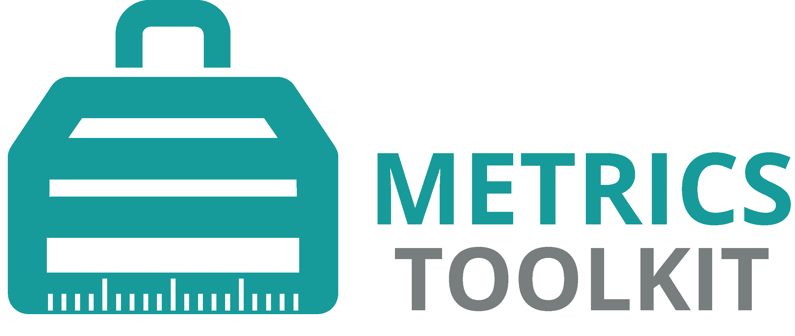

---
hide:
  - navigation
  - toc
---
# Helping You Navigate the Research Metrics Landscape
The Metrics Toolkit provides straightforward and evidence-based information about research metrics across disciplines, including how each metric is derived, potential applications, and known issues.  Faculty, evaluators, librarians and others can use the Metrics Toolkit to facilitate metrics literacy and equitable research evaluation.
